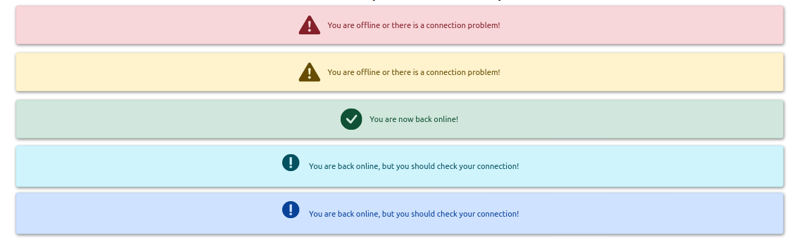

[](https://github.com/rodolphe37/my-awesome-custom-alert/blob/main/LICENSE)
[](https://github.com/rodolphe37/my-awesome-custom-alert/graphs/commit-activity)
[](https://github.com/rodolphe37/my-awesome-custom-alert)
[](https://www.javascript.com/)
[](https://github.com/rodolphe37/my-awesome-custom-alert/issues)
[](https://open.vscode.dev/rodolphe37/my-awesome-custom-alert)
[](https://github.com/Naereen/badges/)


[](https://rodolphe-augusto.fr)
[](https://app.netlify.com/sites/my-awesome-custom-alert/deploys)

# Documentation

---

## My Awesome Custom Alert

it's a reusable custom alert component!

#### :bookmark: We often need to implement modals or notification alerts to users... Why not do it simply and with a little fun?

#### 😉😃😄 - A single component with four alert possibilities & many other options:
> - success,
> - info,
> - warning
> - & error,
> - as well as the option with or without a button embedded in the modal (if the button is appear, you can customize the button text),
> - make appear overlay or not for all alert individually,
> - and you can customize the modal background color for each type of alert.

---

>Desktop view


>Tablets view


mobile view


---

### :computer: Online sites


**You can test My Awesome Custom Alert demo** **[here](https://my-awesome-custom-alert.netlify.app/)**,


---
## Arguments and options!

### the Props availables!
>YOU HAVE 4 POSSIBILITIES - SUCCESS, ERROR, INFO & WARNING ALERT -
YOU CAN CHOOSE IF YOU WANT OVERLAY EFFECT OR NOT
YOU CAN CHANGE THE MODAL ALERT DIMENSIONS (LITTLE, MEDIUM), IF YOU DON'T WRITE ANY PROPS THE DEFAULT DIMENSION IS NORMAL
YOU CAN CUSTOMIZE THE MODAL BACKGROUND COLOR FOR EACH TYPE OF ALERT
YOU CAN CHANGE THE TITLE TEXT & COLOR
YOU CAN CHANGE THE MESSAGE TEXT COLOR ASWELL
YOU CAN MAKE APPEAR OR NOT THE BUTTON (IF THE BUTTON IS APPEAR, YOU CAN CUSTOMIZE THE BUTTON TEXT, COLOR BUTTON & THE TIME OF AUTOMATIC CLOSING )

```javascript

  success, // BOOLEAN value - for appear or not the success window
  successMessage, // STRING - message success
  error, //BOOLEAN value - for appear or not the error window
  errorMessage, // STRING - message error
  warning, // BOOLEAN value - for appear or not the warning window
  warningMessage, // STRING - message warning
  info, // BOOLEAN value - for appear or not the info window
  infoMessage, // STRING - message info
  // GLOBAL PROPS
  overlay, // BOOLEAN - if you want overlay effect or not
  little, // predefined values - the default size is divided by 2
  medium, // predefined values - the default size is divided by 1/3
  customStyleColor, // HEX, rgba, hsl, gradient, etc... - Background value for modal
  titleText, // STRING - title for each alert
  colorTitle, // HEX, rgba, hsl, gradient, etc... - color value for title text
  messageColor, // HEX, rgba, hsl, gradient, etc... - color value for message text
  withButton, // BOOLEAN - value for appear or desappear the button window
  autoClose, // number - time in ms for auto cles alert when you don't have button
  buttonText, // STRING - button content
  colorTextButton, // HEX, rgba, hsl, gradient, etc... - color value for button text
  buttonBackground, // HEX, rgba, hsl, gradient, etc... - Background value for button

```
>:heavy_check_mark: Important!
When you do not display a button in the alert window, the modal closes automatically after 4 seconds.

---
## How to use this component?

>This component does not use any external library, only React.

### Step1 - Copy the component!

>First of all, you have to copy the customAlert folder (which is in the components folder)...
Then paste this folder and its content into the components folder of your application!


OK, the interesting part begins!

### Step2 - Code implementation!

>:heavy_check_mark: All of this examples are the most simple form, of course you can use this component at your fetch/axios responses or more complexe usecases.

***Let's start with the Success option:***

```javascript
import { useState } from "react";
import CustomAlertComponent from "./components/customAlert/CustomAlertComponent";

const ExampleComponent = () => {
   const [displaySuccess, setDisplaySuccess] = useState(false);

     // This function display the success alert
  const handleClickSuccess = () => {
    setDisplaySuccess(true);
    // Your code here
  };

   // Component with Custom alert success
  const SuccessAlert = () => (
    <CustomAlertComponent
      success
       // If you dont want custom background color, just remove this line below, the default color will be chosed.
      customStyleColor="#ef8f9e" // Background value for the modal (ex: HEX, rgba, hsl, gradient, etc...)
      successMessage="yay, everything is working."
      // if you don't want overlay effect remove this line below
      overlay
      // If you dont want button, just remove this two lines below.
      withButton
      buttonText="Great, it's cool!"
    />
  );

  return (
    <div>
      {displaySuccess && (
        <div className="slide-in-top">
          <SuccessAlert />
        </div>
      )}
      <div className="button-container">
        <button className="button-boxApp" onClick={handleClickSuccess}>
          Success Alert
        </button>
      </div>
    </div>
  )
};

export default ExampleComponent;

```

**:heavy_check_mark: The Result**


---

***Next, the Info option:***

```javascript
import { useState } from "react";
import CustomAlertComponent from "./components/customAlert/CustomAlertComponent";

const ExampleComponent = () => {
   const [displayInfo, setDisplayInfo] = useState(false);

     // This function display the Info alert
  const handleClickInfo = () => {
    setDisplayInfo(true);
  };

  // Component with Custom alert info
  const InfoAlert = () => (
    <CustomAlertComponent
      info
      // If you dont want custom background color, just remove this line below, the default gradient color will be choosed.
      customStyleColor="rgba(255, 255,255, 0.7)" // Background value for the modal (ex: HEX, rgba, hsl, gradient, etc...)
      infoMessage="info! be read carefully."
      // if you don't want overlay effect remove this line below
      overlay
      // If you dont want button, remove this line below.
      withButton
      // If you dont write buttonText props, the default text is choosed.
    />
  );

  return (
    <div>
      {displayInfo && (
        <div className="slide-in-top">
          <InfoAlert />
        </div>
      )}
      <div className="button-container">
        <button className="button-boxApp" onClick={handleClickInfo}>
          Info Alert
        </button>
      </div>
    </div>
  )
};

export default ExampleComponent;

```

**:heavy_check_mark: The Result**


---


***Another Option, the warning alert:***

```javascript
import { useState } from "react";
import CustomAlertComponent from "./components/customAlert/CustomAlertComponent";

const ExampleComponent = () => {
   const [displayWarning, setDisplayWarning] = useState(false);

     // This function display the warning alert
  const handleClickWarning = () => {
    setDisplayWarning(true);
  };

  // Component with Custom alert warning
  const WarningAlert = () => (
    <CustomAlertComponent
      warning
      // If you dont want custom background color, just remove this line below, the default color will be chosed.
      customStyleColor="hsl(351, 75%, 75%)" // Background value for the modal (ex: HEX, rgba, hsl, gradient, etc...)
      warningMessage="Be careful what you ask for, you might end up with this!"
      // if you don't want overlay effect remove this line below
      overlay
      // If you dont want button, remove this line below.
      withButton
      // If you dont write buttonText props, the default text is choosed.
    />
  );

  return (
    <div>
      {displayWarning && (
        <div className="bounce-in-top">
          <WarningAlert />
        </div>
      )}
      <div className="button-container">
        <button className="button-boxApp" onClick={handleClickWarning}>
          Warning Alert
        </button>
      </div>
    </div>
  )
};

export default ExampleComponent;

```

**:heavy_check_mark: The Result**


---

***And Then, finally the Error alert:***

```javascript
import { useState } from "react";
import CustomAlertComponent from "./components/customAlert/CustomAlertComponent";

const ExampleComponent = () => {
   const [displayError, setDisplayError] = useState(false);

     // This function display the Error alert
  const handleClickError = () => {
    setDisplayError(true);
  };

  // Component with Custom alert Error
  const ErrorAlert = () => (
    <CustomAlertComponent
      error
      // If you dont want custom background color, just remove this line below, the default color will be chosed.
      customStyleColor="red" // Background value for the modal (ex: HEX, rgba, hsl, gradient, etc...)
      errorMessage="oh no, something went wrong."
      // if you don't want overlay effect remove this line below
      overlay
      // If you dont want button, just remove this two lines below.
      withButton
      buttonText="No worry, try again!"
    />
  );

  return (
    <div>
      {displayError && (
        <div className="bounce-in-top">
          <ErrorAlert />
        </div>
      )}
      <div className="button-container">
         <button className="button-boxApp" onClick={handleClickError}>
          Error Alert
        </button>
      </div>
    </div>
  )
};

export default ExampleComponent;

```

**:heavy_check_mark: The Result**


---

## For more style customization!

>you can change all styles (colors, animations, resize the modal...)
>
>For that you must go to the ```customeAlertStyle.css```, all css styles for all usercase are here and commented!

### And... voilà! you have your awesome reusable custom alert component!

---

## :heavy_exclamation_mark: Bonus - another simple reusable alert component



***The procedure and code implementation is similar to the other component!***

>Copy/paste the offlineMessage folder into your application...

### Props & implementation examples!

>**You have two props:**
>
 > - type (string with five choices - danger - warning - success - info - primary)
 >
 > - content (string - content message to display)

```javascript
...
import OfflineMessage from "./components/bonus/offlineMessage/OfflineMessage";
...

  const demoOfflineMessage = "You are offline or there is a connection problem!";
  const demoOnlineMessage = "You are now back online!";
  const demoInfoAndPrimaryMessage = "You are back online, but you should check your connection!";

<div className="bonus-section">
  <h2>Bonus - another simple reusable alert component</h2>
    <OfflineMessage type="danger" content={`${demoOfflineMessage}`} />
    <OfflineMessage type="warning" content={`${demoOfflineMessage}`} />
    <OfflineMessage type="success" content={`${demoOnlineMessage}`} />
    <OfflineMessage type="info" content={`${demoInfoAndPrimaryMessage}`} />
    <OfflineMessage type="primary" content={`${demoInfoAndPrimaryMessage}`} />
</div>
...
```

## :bust_in_silhouette: Author

- Thought, designed and developed with :purple_heart: by Rodolphe Augusto

---

## :large_blue_diamond: A few words from the author

Enjoy the World :smirk:

---

## :sparkling_heart: Support the project

I put almost everything open-source I can, and try to accommodate anyone who needs help using these projects. Obviously,
this takes time. You can use this service for free.

However, if you are using this project and are happy with it or just want to encourage me to keep creating: -

- Put a star and share the project :rocket:

Thank you! :heart:

---

## :scroll: License

MIT

---

