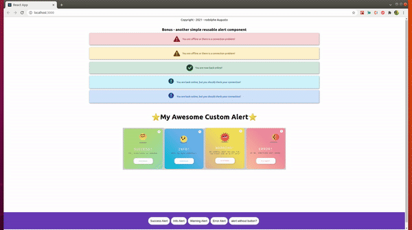
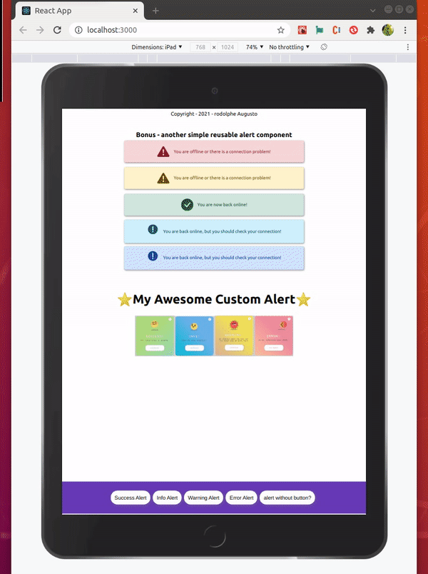

[](https://github.com/rodolphe37/my-awesome-custom-alert/blob/main/LICENSE)
[](https://github.com/rodolphe37/my-awesome-custom-alert/graphs/commit-activity)
[](https://github.com/rodolphe37/my-awesome-custom-alert)
[](https://www.javascript.com/)
[](https://github.com/rodolphe37/my-awesome-custom-alert/issues)
[](https://open.vscode.dev/rodolphe37/my-awesome-custom-alert)
[](https://github.com/Naereen/badges/)


[](https://rodolphe-augusto.fr)
[](https://app.netlify.com/sites/angry-curie-dde5a1/deploys)

# Documentation

---

## My Awesome Custom Alert

it's a reusable custom alert component!

#### :bookmark: We often need to implement modals or notification alerts to users... Why not do it simply and with a little fun?

#### 😉😃😄 A single component with four possibilities - success, info, warning & error, as well as the option with or without a button embedded in the modal.

---

>Desktop



>Tablets view



mobile views


---

### :computer: Online sites


**You can test My Awesome Custom Alert demo** **[here](https://my-awesome-custom-alert.netlify.app/)**,

**And the version with input for writing what you want during test** **[here](https://reusable-alert-tutorial.netlify.app/)**,

---
## Arguments and options!

### the Props availables!

```javascript
  success, // boolean value for appear or not the success window
  successMessage, // string message success
  error, //boolean value for appear or not the error window
  errorMessage, // string message error
  warning, // boolean value for appear or not the warning window
  warningMessage, // string message warning
  info, // boolean value for appear or not the info window
  infoMessage, // string message info
  withButton, // boolean value for appear or desappear the button window for all types of alert (by default is true)

```
>:heavy_check_mark: Important!
When you do not display a button in the alert window, the modal closes automatically after 4 seconds.

---
## How to use this component?

>This component does not use any external library, only React.

### Step1 - Copy the component!

>First of all, you have to copy the customAlert folder (which is in the components folder)...
Then paste this folder and its content into the components folder of your application!


OK, the interesting part begins!

### Step2 - Code implementation!

>:heavy_check_mark: All of this examples are the most simple form, of course you can use this component at your fetch/axios responses or more complexe usecases.

***Let's start with the Success option:***

```javascript
import { useState } from "react";
import CustomAlertComponent from "./components/customAlert/CustomAlertComponent";

const ExampleComponent = () => {
   const [displaySuccess, setDisplaySuccess] = useState(false);

     // This function display the success alert
  const handleClickSuccess = () => {
    setDisplaySuccess(true);
    // Your code here
  };

   // Component with Custom alert success
  const SuccessAlert = () => (
    <CustomAlertComponent
      success
      successMessage="yay, everything is working."
      // If you dont want button, just remove this line below.
      withButton
    />
  );

  return (
    <div>
      {displaySuccess && (
        <div className="slide-in-top">
          <SuccessAlert />
        </div>
      )}
      <div className="button-container">
        <button className="button-boxApp" onClick={handleClickSuccess}>
          Success Alert
        </button>
      </div>
    </div>
  )
};

export default ExampleComponent;

```

**:heavy_check_mark: The Result**


---

***Next, the Info option:***

```javascript
import { useState } from "react";
import CustomAlertComponent from "./components/customAlert/CustomAlertComponent";

const ExampleComponent = () => {
   const [displayInfo, setDisplayInfo] = useState(false);

     // This function display the Info alert
  const handleClickInfo = () => {
    setDisplayInfo(true);
  };

  // Component with Custom alert info
  const InfoAlert = () => (
    <CustomAlertComponent
      info
      infoMessage="info! be read carefully."
      // If you dont want button, remove this line below.
      withButton
    />
  );

  return (
    <div>
      {displayInfo && (
        <div className="swing-in-top-fwd">
          <InfoAlert />
        </div>
      )}
      <div className="button-container">
        <button className="button-boxApp" onClick={handleClickInfo}>
          Info Alert
        </button>
      </div>
    </div>
  )
};

export default ExampleComponent;

```

**:heavy_check_mark: The Result**


---


***Another Option, the warning alert:***

```javascript
import { useState } from "react";
import CustomAlertComponent from "./components/customAlert/CustomAlertComponent";

const ExampleComponent = () => {
   const [displayWarning, setDisplayWarning] = useState(false);

     // This function display the warning alert
  const handleClickWarning = () => {
    setDisplayWarning(true);
  };

  // Component with Custom alert warning
  const WarningAlert = () => (
    <CustomAlertComponent
      warning
      warningMessage="Be careful what you ask for, you might end up with this!"
      // If you dont want button, remove this line below.
      withButton
    />
  );

  return (
    <div>
      {displayWarning && (
        <div className="bounce-in-top">
          <WarningAlert />
        </div>
      )}
      <div className="button-container">
        <button className="button-boxApp" onClick={handleClickWarning}>
          Warning Alert
        </button>
      </div>
    </div>
  )
};

export default ExampleComponent;

```

**:heavy_check_mark: The Result**


---

***And Then, finally the Error alert:***

```javascript
import { useState } from "react";
import CustomAlertComponent from "./components/customAlert/CustomAlertComponent";

const ExampleComponent = () => {
   const [displayError, setDisplayError] = useState(false);

     // This function display the Error alert
  const handleClickError = () => {
    setDisplayError(true);
  };

  // Component with Custom alert Error
  const ErrorAlert = () => (
    <CustomAlertComponent
      error
      errorMessage="oh no, something went wrong."
      // If you dont want button, remove this line below.
      withButton
    />
  );

  return (
    <div>
      {displayError && (
        <div className="bounce-in-top">
          <ErrorAlert />
        </div>
      )}
      <div className="button-container">
         <button className="button-boxApp" onClick={handleClickError}>
          Error Alert
        </button>
      </div>
    </div>
  )
};

export default ExampleComponent;

```

**:heavy_check_mark: The Result**


---

## For more style customization!

>you can change all styles (colors, animations, resize the modal...)
>
>For that you must go to the ```customeAlertStyle.css```, all css styles for all usercase are here and commented!

### And... voilà! you have your awesome reusable custom alert component!

---

## :heavy_exclamation_mark: Bonus - another simple reusable alert component

***The procedure and code implementation is similar to the other component!***

>Copy/paste the offlineMessage folder into your application...

### Props & implementation examples!

```javascript
...
import OfflineMessage from "./components/bonus/offlineMessage/OfflineMessage";
...

 const demoOfflineMessage =
    "You are offline or there is a connection problem!";

<div className="bonus-section">
  <h2>Bonus - another simple reusable alert component</h2>
  <OfflineMessage
    type="danger"
    content={`${demoOfflineMessage}`}
  />
  <OfflineMessage
    type="warning"
    content={`${demoOfflineMessage}`}
  />
  <OfflineMessage
    type="info"
    content={`${demoOfflineMessage}`}
  />
  <OfflineMessage
    type="primary"
    content={`${demoOfflineMessage}`}
  />
</div>
...
```

## :bust_in_silhouette: Author

- Thought, designed and developed with :purple_heart: by Rodolphe Augusto

---

## :large_blue_diamond: A few words from the author

Enjoy the World :smirk:

---

## :sparkling_heart: Support the project

I put almost everything open-source I can, and try to accommodate anyone who needs help using these projects. Obviously,
this takes time. You can use this service for free.

However, if you are using this project and are happy with it or just want to encourage me to keep creating: -

- Put a star and share the project :rocket:

Thank you! :heart:

---

## :scroll: License

MIT

---

